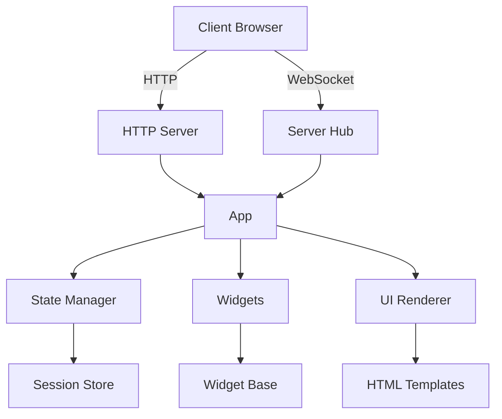

# Streamlit Go 架构文档

## 1. 概述

Streamlit Go 是一个用 Go 语言实现的 Streamlit 框架，用于快速构建交互式数据应用。它提供了类似 Python Streamlit 的 API，但使用 Go 语言实现，具有更好的性能和更低的资源消耗。

## 2. 核心组件

### 2.1 App (应用核心)
- **位置**: [app/app.go](file:///Volumes/ssd/myproject/streamlit-go/app/app.go)
- **职责**: 
  - 管理整个应用的生命周期
  - 协调各个组件的工作
  - 提供用户-facing API
  - 管理全局组件队列

### 2.2 Server (服务层)
- **位置**: [server/](file:///Volumes/ssd/myproject/streamlit-go/server/)
- **职责**:
  - HTTP 服务器实现
  - WebSocket 连接管理
  - 消息处理和路由
  - Hub 管理所有客户端连接

### 2.3 State (状态管理)
- **位置**: [state/](file:///Volumes/ssd/myproject/streamlit-go/state/)
- **职责**:
  - 会话管理
  - 状态存储
  - 会话超时和清理

### 2.4 Widgets (组件系统)
- **位置**: [widgets/](file:///Volumes/ssd/myproject/streamlit-go/widgets/)
- **职责**:
  - 实现各种 UI 组件
  - 组件渲染
  - 事件处理

### 2.5 UI (渲染层)
- **位置**: [ui/](file:///Volumes/ssd/myproject/streamlit-go/ui/)
- **职责**:
  - HTML 渲染
  - 组件布局

### 2.6 Templates (模板)
- **位置**: [ptemplate/](file:///Volumes/ssd/myproject/streamlit-go/ptemplate/)
- **职责**:
  - HTML 模板管理
  - 页面结构定义

## 3. 架构图

## 4. 数据流

1. **应用启动**:
   - App 初始化并启动 HTTP 服务器和 WebSocket Hub
   - State Manager 启动会话清理任务

2. **客户端连接**:
   - 客户端通过 HTTP 请求获取页面
   - 客户端通过 WebSocket 连接到 Hub
   - Hub 注册客户端并关联会话

3. **事件处理**:
   - 客户端触发事件（点击按钮、输入文本等）
   - 事件通过 WebSocket 发送到 Hub
   - Hub 将事件转发给 App 处理
   - App 查找对应组件并触发回调
   - 更新 UI 并发送回客户端

4. **UI 更新**:
   - 组件状态变更后触发 UI 更新
   - 通过 WebSocket 将更新发送到客户端
   - 客户端更新 DOM

## 5. 会话管理

Streamlit Go 支持多用户会话隔离：

- 每个用户拥有独立的会话 ID
- 会话状态存储在 Session 对象中
- 组件可以是全局共享或会话私有
- 会话超时自动清理（默认 5 分钟）

## 6. 组件系统

组件系统采用面向对象设计：

- 所有组件实现 Widget 接口
- BaseWidget 提供通用功能
- 具体组件继承 BaseWidget
- 支持事件回调机制